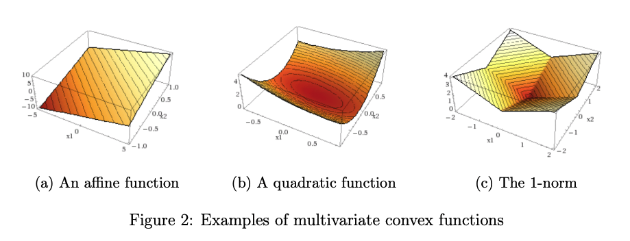

# Gradient Descent

Gradient descent is a method for unconstrained mathematical optimization. It is a first-order iterative algorithm for finding a local minimum of a differentiable multivariate function.

The algorithm for Gradient Descent was written by Louis Augustin Cauchy, A French Mathematician, in 1847 in his work, [Methode generale pour la resolution des systemes d'equations simultanees](https://cir.nii.ac.jp/crid/1573668925829538688?lang=en) (The term Machine Learning was coined in 1959 by Arthur Samuel). This means Gradient Descent is a general-purpose optimization algorithm and was adapted for Machine Learning.

## What is Gradient Descent?

Given a multi-variable function $C(v_1, v_2, ... , v_j)$, gradient descent solves the values of $v_1, v_2, ... , V_j$ at which the value of the function $C(v)$ is local minimum.

!!! info
    Gradient Descent is an iterative algorithm (as you will see in a bit) and works best when the function $C(v)$ is a convex function.

    <figure markdown>
        {width="600"}
        <figcaption>Gradient Descent finds global minima for convex multi-variable functions. 
        <a href = "https://www.princeton.edu/~aaa/Public/Teaching/ORF523/S16/ORF523_S16_Lec7_gh.pdf">Source</a>
        </figcaption>
    </figure>

Let $C(v)$ be a fully convex quadratic function with two variables $v_1, v_2$. Example of such functions can be:

$$
C(v_1, v_2) = v_1^2+v_2^2
$$

The plot for the function $C(v)$ looks like:

<figure markdown>
{width="400"}
    <figcaption>C(v) plot. 
    <a href = "http://neuralnetworksanddeeplearning.com/images/valley.png">Source</a>
    </figcaption>
</figure>

The variables to be solved here are $v_1$ and $v_2$ when the function $C(v)$ is minimum. As we have a very simple function here with us, we can eye ball the minimum value of the function. In many scenarions, the function $C(v)$ could look very complicated, yet convex.

In Linear Algebra and calculus, a **convex uni-variate function is minimum where the slope is $0$**. In the above function too, finding derivatives of the function w.r.t. the variables and equating them to zero is very simple. However, **gradient descent is a general-purpose algoritm and is made to work with functions with many variables.** (where optimization/differenentiation through plain calculus does not work).

## The Intuition

If we look closely, all convex multi-variate functions have a valley-like structure and this structure leads to the global minima. The intuition is that, if we imagine a ball at any point on the curve and roll it down the "valley" shape, it shall reach the global minima. This is bound to happen, as the function is convex and the local and global minima converge to the same point.

### Quick questions:
1. How do we initialize a point on the curve randomly?
2. What is meant by the "valley" shape and how to move along the "valley" shape of the curve?
3. When do we know if the minima is reached? Is there a hard limit on the number of steps (or the time for rolling)?

## Why does this intuition makes sense and how do we implement it?

