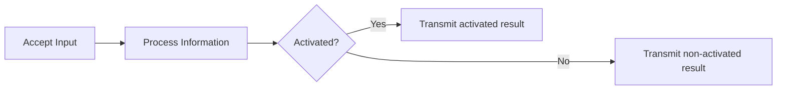

# Basics of decision-making and modeling the human brain.

1. How does the human brain work? How exactly do we make decisions?
2. What happens in the complex super computer that we carry in our heads that contains 100 billion neurons?

Cracking these questions has been the holy grail of neuroscience that could (in-theory) pave way for the (seemingly) ultimate goal of mankind, **creating an artificial brain with human-level cognition**.

While these potential applications seem fascinating, let's not get carried away. Let's ask more important pragmatic questions.

1. How far have we come to UNDERSTAND the internal workings of the human brain?
2. How far have we come to MODEL the internal workings of the human brain?

I leave the first question to the best researchers in neuroscience. We shall come back to this question in later chapters.

The second question is where the field of Artificial Intelligence really comes into picture. How exactly do we model the human brain (specifically the decision-making process) and how far have we come?

!!! info "Artificial Intelligence"

    Artificial intelligence (AI) is a multidisciplinary field of computer science focused on creating machines and software capable of performing tasks that typically require human intelligence, such as learning, problem-solving, language understanding, and decision-making.

## Fundamental Information Unit (Neuron)

Neuroscience says that Neuron is the fundamental unit that is responsible for transferring information in the human brain. Early efforts in Artificial Intelligence concentrated around modeling such fundamental information units.

!!! info "How exactly do we model a neuron?"
    <figure markdown>
        {width="500"}
        <figcaption>Biological Neuron. 
        <a href = "https://images.squarespace-cdn.com/content/v1/55fee1eee4b07f44d4c4f81d/1573090083711-QEFIP2WBUJAG59YJ9YKX/800px-Neuron.svg.png">Source</a>
        </figcaption>
    </figure>

    Don't be intimidated by the complexities in the above figure. I assure you, this is not a biology lecture. Let's shift our attention on important components.

    1. A Neuron takes input signals through dendrites.
    2. Trasnmits the information through Nucleus and Axon.
    3. Based on the activation of Neuron, the (processed) information is transmitted to other neurons through Axon Terminals.

### AI started here!

Researchers in AI started modeling the human brain from here. We needed a unit that could:

1. Take input information (like Dendrites).
2. Process the information (like Nucleus and Axon)(1).
    { .annotate }

    1. How exactly to process information, what does processing even mean? We will come back to this, soon.

3. Transmit the information forward to other neurons.

!!! example
    **Let's go through an example to make the requirement clearer.**

    Let's assume you want to decide if you want to buy a new car or not? You are required to decide between **Yes** or **No**. Think about how exactly would one go about it?

Before you start making a decision, you would first come up with some questions based on which we want to make a decision, such as:

1. How often do I find myself needing a car?
2. Am I financially capable of owing and maintaining a car?
3. How many of my colleagues have a car? (Buying a car might be a symbol of prestige to you).

Now based on all these questions you would make the decision of buying a car. However, you would not stop there. Let's assume having a car to travel to your work place is **really** important to you. In this case the first question would have more **weight** than the rest of the questions. Similarly, if you are financially incapable of affording a car, you would find it increasing difficult to decide in favor of purchasing a car.

!!! info
    In other words, we formulate a set of binary inputs (also called features) with a weight associated to each feature representing the relative importance of each feature and based on the values of these features our decision is effected.

Let's start representing things to make this concept clear. Let's assume we just have $3$ features that we use to make a binary decision and each of these features is represented by $x_1$, $x_2$, and $x_3$. Let the weights of these features be $w_1$, $w_2$, and $w_3$, Hence the pictorial representation of the above decision-making model would look like:

The above model is known as the **Perceptron** model (also known as an artificial neuron).

**How exactly do we go from inputs to these features to a decision output?**

All we have until now is:

1. We have a bunch of binary inputs $x_1$, $x_2$, and $x_3$.
2. Each input comes with a corresponding weight $w_1$, $w_2$, and $w_3$.

The most plausible idea is to take a weighted sum of inputs to get an idea of the **signal**.

For example, if the feature $x_1$ matters to you more, then its accompanied by a larger positive weight $w_1$ and vice-versa.

$$
\text{Weighted sum }= \sum_j x_j w_j
$$

What after weighted sum? Let's say positive weights denote towards the decision "YES" and negative the decision "NO", if the weighted sum is very positive, you shall lean towards the decision "YES".

This gives us a basic version of a decision-making model and the **threshold** is up to our discretion (We shall deal with this very shortly).

$$
\text{output } = \left\{ \begin{matrix}
\text{Yes if } \sum_j x_j w_j \geq \text{threshold}\\ 
\text{No if } \sum_j x_j w_j < \text{threshold}\\
\end{matrix}\right.
$$

There it is! We are getting closer to making a basic decision-making model. 

One neat trick is to incorporate this threshold into decision-making (named bias). The above equation changes to:

$$
\text{output } = \left\{ \begin{matrix}
\text{Yes if } \sum_j x_j w_j - \text{threshold (b)} \geq 0\\ 
\text{No if } \sum_j x_j w_j - \text{threshold (b)} < 0\\
\end{matrix}\right.
$$

`b is replaced with -b in most books/reference material for simplicity.`

**Perceptron**

1. Takes in binary inputs $x_1, ... x_i$ and their corresponding weights $w_1, ... w_i$.
2. Computes the weighted sum for each input.
3. Takes a binary decision based on a **threshold**.

### But how does the perceptron learn?

$$
\text{output } = \left\{ \begin{matrix}
\text{Yes if } \sum_j x_j w_j + b \geq 0\\ 
\text{No if } \sum_j x_j w_j + b < 0\\
\end{matrix}\right.
$$

Take a hard look at the above equation. 

1. What are the variables to be solved, above? ($x_i$ represent the input features and the output is a decision. These are known to us. What we need are the optimal values of $w_i$ and $b$ that will help us make decision for unseen variables $x_k$).

2. We need to come up with a framework, where we shall give a network (made of perceptrons) a bunch of examples (supervised learning) and network should come up with optimal values for weights and bias.

<!-- We made sure  -->

<!-- **Thoughts about how to find the optimal values for weights $w_i$ and threshold (or bias) $b$ to be able to make decisions.**

1. The weights are to be learnt (by our basic model) by looking a bunch of examples.
2. The bias of the model is yet another learnable parameter that is learnt based on examples. -->

!!! success "Perceptron"
    There we have it. A very basic decision-making model. Although the model is far from complete, we have a model that takes in a bunch of binary inputs, calculates the weighted sum and gives out a prediction based on the inputs.

    **Our next step is to make this model LEARN** on it's own to find the optimal weights and make decisions.

